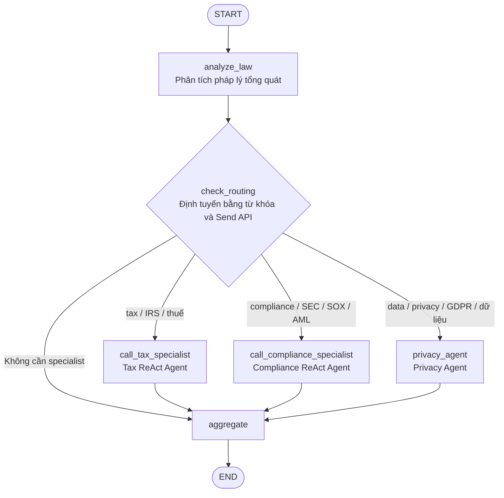
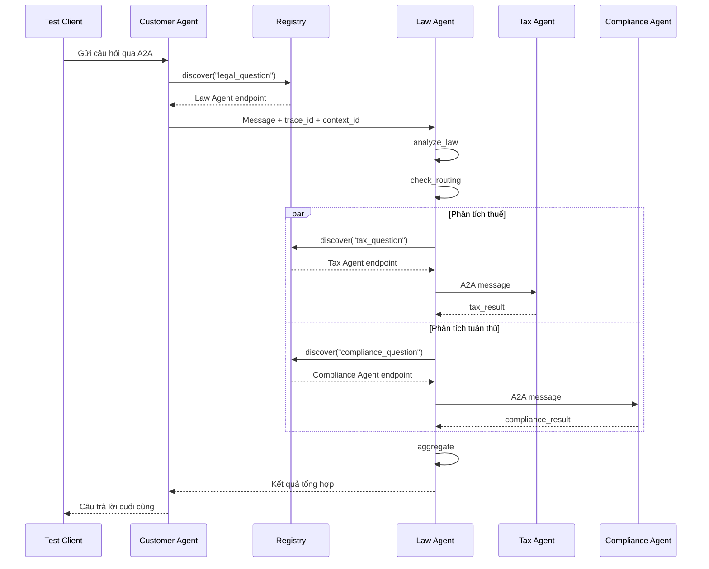

# Báo Cáo Hoàn Thành Lab Multi-Agent Và A2A

## 1. Tổng Quan

Lab minh họa quá trình phát triển hệ thống LLM qua năm giai đoạn:

```text
Direct LLM
  -> LLM + Tools
  -> ReAct Agent
  -> Multi-Agent In-Process
  -> Distributed A2A
```

Các bài thực hành đã hoàn thành:

- Stage 1: thay đổi câu hỏi Direct LLM và cấu hình `temperature=0.3`.
- Stage 2: thêm knowledge base luật lao động và tool kiểm tra thời hiệu.
- Stage 3: thêm tool `search_case_law` cho ReAct Agent.
- Stage 4: thêm `privacy_agent`, conditional routing và sơ đồ kiến trúc.
- Stage 5: trace request, kiểm tra lỗi khi Tax Agent dừng và rút gọn phản hồi.

## 2. Stage 1: Direct LLM

### Bài 1.1: Thay đổi câu hỏi

Câu hỏi trong `stages/stage_1_direct_llm/main.py` đã được đổi sang chủ đề luật lao
động Việt Nam:

```text
Theo pháp luật Việt Nam, người sử dụng lao động có thể đơn phương chấm dứt
hợp đồng lao động trong những trường hợp nào?
```

### Bài 1.2: Temperature control

Hàm `get_llm()` trong `common/llm.py` đọc temperature từ biến môi trường:

```python
temperature = float(os.getenv("LLM_TEMPERATURE", "0.3"))
```

Giá trị mặc định `0.3` giúp kết quả ổn định hơn nhưng vẫn cho phép thay đổi qua
environment variable.

## 3. Stage 2: LLM, RAG Và Tools

Phần bài tập được triển khai trong `exercises/exercise_2_tools.py`.

### Bài 2.1: Knowledge base luật lao động

Đã thêm entry `labor_law` với các từ khóa tiếng Việt và tiếng Anh:

```python
{
    "id": "labor_law",
    "keywords": [
        "lao động",
        "sa thải",
        "hợp đồng lao động",
        "labor",
        "termination",
    ],
    "text": "Thông tin về quyền đơn phương chấm dứt hợp đồng lao động...",
}
```

### Bài 2.2: Tool kiểm tra thời hiệu

Đã tạo và đăng ký tool:

```python
@tool
def check_statute_of_limitations(case_type: str) -> str:
    limits = {
        "contract": "4 năm (UCC § 2-725)",
        "tort": "2-3 năm tùy bang",
        "property": "5 năm",
    }
    return limits.get(case_type.lower(), "Không xác định")
```

Tool được bind với LLM và được kiểm tra bằng câu hỏi về thời hiệu khởi kiện vi
phạm hợp đồng.

## 4. Stage 3: Single Agent Với ReAct

### Bài 3.1: Tool tra cứu án lệ

Đã thêm `search_case_law` vào `stages/stage_3_single_agent/main.py` và đăng ký
trong `TOOLS`.

| Từ khóa | Án lệ |
|---|---|
| `breach` | Hadley v. Baxendale (1854) |
| `negligence` | Donoghue v. Stevenson (1932) |
| `contract` | Carlill v. Carbolic Smoke Ball Co (1893) |

Câu hỏi kiểm tra yêu cầu phân tích breach of contract và án lệ liên quan.

### Bài 3.2: Theo dõi quá trình Agent

Phiên bản LangGraph đang dùng không truyền `verbose=True` vào
`create_react_agent`. Chương trình sử dụng:

```python
graph.astream(inputs, stream_mode="updates")
```

Mỗi bước được in theo ba nhóm `THINK + ACT`, `OBSERVE` và `FINAL ANSWER`, cho
phép theo dõi tool call và kết quả của tool trong quá trình chạy.

## 5. Stage 4: Multi-Agent In-Process

### Kiến trúc



### Bài 4.1: Privacy Agent

`privacy_agent` chuyên phân tích:

- GDPR và CCPA.
- Nghĩa vụ của controller và processor.
- Quyền của chủ thể dữ liệu.
- Nghĩa vụ thông báo data breach.
- Chuyển dữ liệu cá nhân xuyên biên giới.

Kết quả được ghi vào field riêng trong shared state và đưa vào node `aggregate`.

### Bài 4.2: Conditional routing

`check_routing` chỉ gửi task đến specialist phù hợp:

- Tax Agent: `tax`, `irs`, `thuế`.
- Compliance Agent: `compliance`, `regulation`, `sec`, `sox`, `aml`, `fcpa`.
- Privacy Agent: `data`, `privacy`, `gdpr`, `ccpa`, `dữ liệu`.

Các specialist được dispatch bằng LangGraph `Send` API và có thể chạy song song.
Nếu không có specialist phù hợp, workflow đi thẳng đến `aggregate`.

## 6. Stage 5: Distributed A2A

### 6.1 Kiến trúc service

| Service | Port | Trách nhiệm |
|---|---:|---|
| Registry | 10000 | Đăng ký và tìm agent theo loại task |
| Customer Agent | 10100 | Nhận câu hỏi và ủy quyền cho Law Agent |
| Law Agent | 10101 | Phân tích, định tuyến và tổng hợp |
| Tax Agent | 10102 | Phân tích pháp luật thuế |
| Compliance Agent | 10103 | Phân tích tuân thủ quy định |

### 6.2 Luồng request



### 6.3 Bài 5.1: Trace request

`test_client.py` tự sinh và gửi `trace_id`, `context_id` trong A2A metadata.
Customer Agent tiếp tục truyền các giá trị này đến Law, Tax và Compliance Agent.
Các `AgentExecutor` ghi metadata vào log để theo dõi request qua nhiều service.

Trace của fault test:

```text
trace_id: f5ced465-6275-4761-9f41-4d289768dff4
context_id: 31ce5f99-592f-483f-bd19-1462f3efbacf
```

Trace sau khi khởi động lại Tax Agent:

```text
trace_id: b9592ced-88f0-4cdc-b278-6fe2f9ddcb6d
context_id: ef060a9d-8aba-4823-8b0b-0320be0b43a6
```

Registry chưa nhận trace metadata nên log discovery chưa thể liên kết trực tiếp
bằng `trace_id`.

### 6.4 Bài 5.2: Dynamic discovery và xử lý lỗi

Quy trình kiểm tra:

1. Dừng riêng Tax Agent.
2. Giữ Registry, Customer, Law và Compliance Agent hoạt động.
3. Chạy lại `test_client.py`.
4. Kiểm tra log và phản hồi cuối cùng.

Kết quả:

- Registry vẫn trả endpoint cũ của Tax Agent vì chưa có heartbeat hoặc TTL.
- Kết nối đến Tax Agent thất bại.
- `call_tax` bắt exception và trả `Tax analysis unavailable`.
- Law Agent và Compliance Agent tiếp tục xử lý.
- Node `aggregate` vẫn tạo được phản hồi từ các kết quả còn lại.
- Request không làm dừng toàn bộ hệ thống.

Nội dung cuối vẫn có thể nhắc đến thuế vì Law Agent và model tổng hợp cũng có
kiến thức về thuế. Cần dùng log theo `trace_id`, không chỉ dựa vào nội dung câu
trả lời, để xác nhận specialist đã được gọi thành công.

### 6.5 Bài 5.3: Thay đổi Tax Agent

Prompt của Tax Agent được cập nhật để:

- Trả lời dưới 150 từ.
- Ưu tiên hình phạt dân sự và hình sự quan trọng.
- Xác định cá nhân hoặc tổ chức chịu trách nhiệm.
- Đề xuất hành động cần thực hiện ngay.
- Không lặp lại câu hỏi.

Kết quả gọi trực tiếp Tax Agent sau khi restart là 115 từ, đáp ứng giới hạn.
Phản hồi cuối từ hệ thống vẫn có thể dài hơn do Law Agent và Customer Agent tiếp
tục tổng hợp và định dạng lại nội dung.

## 7. Câu Hỏi Ôn Tập

### 7.1 Khi nào nên dùng Single Agent?

Single Agent phù hợp khi bài toán thuộc một domain rõ ràng, có ít tool, luồng xử
lý đơn giản và không cần nhiều tác vụ chạy song song. Cách này dễ triển khai,
debug nhanh và tốn ít API call hơn.

Multi-Agent phù hợp khi bài toán cần nhiều chuyên môn độc lập như hợp đồng,
thuế, tuân thủ và quyền riêng tư, hoặc khi các tác vụ có thể chạy song song.

### 7.2 A2A có ưu điểm gì so với REST hoặc gRPC thông thường?

REST và gRPC là cơ chế giao tiếp tổng quát. A2A bổ sung các khái niệm dành riêng
cho agent:

- `Agent Card` mô tả danh tính, endpoint và capability.
- Cấu trúc chuẩn cho `Message`, `Task`, `Part` và `Artifact`.
- Discovery theo capability hoặc loại task.
- `context_id` liên kết các task trong một hội thoại.
- `trace_id` hỗ trợ theo dõi request qua nhiều agent.
- Khả năng tương tác giữa agent dùng framework hoặc nhà cung cấp khác nhau.

A2A không thay thế HTTP mà định nghĩa giao thức ứng dụng và cấu trúc dữ liệu
phía trên HTTP.

### 7.3 Làm thế nào ngăn infinite delegation loop?

Project sử dụng:

```python
MAX_DELEGATION_DEPTH = 3
```

Các biện pháp có thể kết hợp:

- Tăng `delegation_depth` sau mỗi lần chuyển request.
- Dừng delegation khi đạt giới hạn.
- Lưu danh sách agent đã đi qua.
- Phát hiện chu trình trong delegation graph.
- Đặt timeout cho từng request và toàn workflow.
- Giới hạn retry và tổng số hop.
- Chỉ cho phép gọi các agent hoặc task được cấp quyền.

### 7.4 Tại sao cần Registry?

Registry cho phép agent tự đăng ký endpoint và capability khi khởi động. Agent
khác có thể tìm service theo task mà không cần hardcode URL.

Lợi ích:

- Không phải sửa caller khi endpoint thay đổi.
- Giảm liên kết trực tiếp giữa các agent.
- Có thể mở rộng sang nhiều instance và load balancing.
- Có thể bổ sung health check, heartbeat và TTL.

Hardcode URL phù hợp với demo rất nhỏ nhưng khó bảo trì và scale. Registry hiện
lưu dữ liệu trong memory và chưa có health check, vì vậy vẫn có thể trả endpoint
của một agent đã dừng.

## 8. Kết Quả Kiểm Tra

- Năm service đã được khởi động đầy đủ.
- Registry hiển thị đủ bốn agent.
- Request end-to-end chạy thành công.
- `trace_id` và `context_id` được truyền xuyên suốt A2A metadata.
- Hệ thống tiếp tục phản hồi khi Tax Agent dừng.
- Tax Agent đã được rút gọn phản hồi xuống dưới 150 từ.
- Toàn bộ source Python vượt qua kiểm tra `compileall`.
- Tám unit/API test của Stage 5 client, CLI và web demo đều pass.

## 9. Bài Tập Cộng Điểm

### 9.1 Web demo Stage 5

Thư mục `web_demo/` cung cấp giao diện Vite để:

- Hiển thị trạng thái Registry, Customer, Law, Tax và Compliance Agent.
- Chọn tuyến baseline hoặc optimized.
- Gửi câu hỏi pháp lý tới Stage 5.
- Hiển thị route, `trace_id`, `context_id`, phản hồi và end-to-end latency.

Backend FastAPI đồng thời phục vụ static fallback khi máy không có Node:

```bash
uv run python -m web_demo.server
```

Mở `http://127.0.0.1:8080`. Nếu có Node/npm, chạy thêm Vite:

```bash
cd web_demo
npm install
npm run dev
```

### 9.2 Đo và giảm latency

Phương án tối ưu là bỏ Customer Agent khi caller đã xác định chắc chắn input là
câu hỏi pháp lý. Tuyến `direct-law` vẫn dùng Registry, Law Agent, Tax Agent,
Compliance Agent và A2A, nhưng loại bỏ các lượt LLM dùng để phân loại và diễn
đạt lại phản hồi tại Customer Agent.

Kết quả một lần benchmark đại diện ngày 10/06/2026, cùng câu hỏi và model
`mimo-v2.5-pro`:

| Chế độ | Latency | Trace ID |
|---|---:|---|
| Baseline `customer` | 178.84 giây | `b7620f50-5d28-42f5-a278-7b207930a4a5` |
| Optimized `direct-law` | 127.33 giây | `df659acf-5175-4d1d-a9ae-93599e972164` |

Kết quả:

- Giảm `51.51` giây.
- Latency giảm `28.8%`.
- Cả hai request đều hoàn tất và trả đủ phân tích pháp lý, thuế và tổng hợp.

Có thể chạy lại phép đo bằng:

```bash
uv run python test_client.py --mode compare --json
```

Số liệu LLM có thể dao động theo tải của provider và độ dài output. Để đánh giá
production nên chạy nhiều lần và báo cáo median cùng p95.

## 10. Kết Luận

Năm stage thể hiện quá trình tăng dần về khả năng và độ phức tạp, từ một lời gọi
LLM trực tiếp đến hệ thống agent phân tán. Kiến trúc cuối hỗ trợ chuyên môn hóa,
thực thi song song, dynamic discovery, trace request và cô lập lỗi từng phần.
