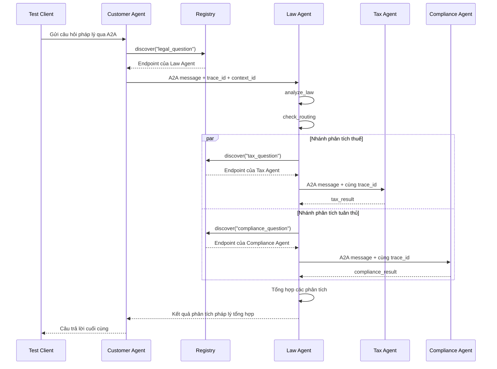

# Stage 5: Lab Distributed A2A

## Kiến Trúc

| Service | Port | Trách nhiệm |
|---|---:|---|
| Registry | 10000 | Đăng ký agent và tìm agent theo loại tác vụ |
| Customer Agent | 10100 | Điểm vào hệ thống và ủy quyền câu hỏi cho Law Agent |
| Law Agent | 10101 | Phân tích pháp lý, định tuyến và tổng hợp kết quả |
| Tax Agent | 10102 | Agent chuyên về pháp luật thuế |
| Compliance Agent | 10103 | Agent chuyên về tuân thủ quy định |

## Luồng Request



## 5.1 Theo Dõi Luồng Request

Lần chạy end-to-end đầu tiên đã thành công:

```text
test_client.py
  -> Customer Agent
  -> Law Agent
  -> Tax Agent và Compliance Agent chạy song song
  -> Law Agent tổng hợp kết quả
  -> Customer Agent
  -> test_client.py nhận response
```

Sao chép một `trace_id` từ log của Customer Agent và xác nhận cùng giá trị đó
xuất hiện trong log của Law, Tax và Compliance Agent:

```text
trace_id: <dán trace ID vào đây>
Customer Agent: đã xác nhận / chưa xác nhận
Law Agent: đã xác nhận / chưa xác nhận
Tax Agent: đã xác nhận / chưa xác nhận
Compliance Agent: đã xác nhận / chưa xác nhận
```

Registry hiện không nhận trace metadata. Log của Registry vẫn hiển thị các lần
discovery, nhưng chưa thể liên kết chúng với request bằng `trace_id`.

## 5.2 Dynamic Discovery Và Xử Lý Lỗi

Các bước kiểm tra:

1. Chỉ dừng Tax Agent bằng `Ctrl+C`.
2. Giữ Registry, Customer, Law và Compliance Agent tiếp tục chạy.
3. Chạy `python test_client.py`.
4. Quan sát log Law Agent và câu trả lời cuối cùng.

Kết quả mong đợi:

- Registry vẫn trả endpoint Tax Agent đã đăng ký trước đó.
- Kết nối A2A tới Tax Agent đã dừng sẽ thất bại.
- `call_tax` bắt exception và trả về kết quả `Tax analysis unavailable`.
- Law Agent và Compliance Agent vẫn tiếp tục xử lý.
- Node `aggregate` vẫn có thể tạo câu trả lời từ các kết quả còn lại.

Ghi nhận thực tế:

```text
Kết quả: chưa thực hiện
Lỗi quan sát được: chưa thực hiện
Toàn bộ hệ thống có bị dừng không: chưa xác nhận
Response có chứa các phân tích còn lại không: chưa xác nhận
```

Kết luận dự kiến: Registry là service discovery lưu dữ liệu trong memory, chưa
có health check hoặc tự động xóa agent đã dừng. Law Agent có khả năng chịu lỗi
một phần vì nó cô lập lỗi của từng specialist agent.

## 5.3 Thay Đổi Hành Vi Tax Agent

Prompt của Tax Agent hiện yêu cầu:

- Câu trả lời cuối dưới 150 từ.
- Ưu tiên các hình phạt dân sự và hình sự quan trọng.
- Xác định cá nhân hoặc tổ chức phải chịu trách nhiệm.
- Nêu hành động cần thực hiện ngay.
- Không lặp lại câu hỏi của người dùng.

Các bước xác nhận:

1. Restart Tax Agent để nạp prompt mới.
2. Chạy lại `python test_client.py`.
3. So sánh phần Tax Agent trước và sau khi thay đổi.

```text
Trước: phần phân tích thuế chi tiết và dài.
Sau: chưa xác nhận; dự kiến ngắn hơn và tập trung vào các ý quan trọng.
```

## Checklist Hoàn Thành Stage 5

- [x] Đã khởi động đủ năm service.
- [x] Registry hiển thị đủ bốn agent.
- [x] Request end-to-end đầu tiên chạy thành công.
- [ ] Đã xác nhận một `trace_id` trên Customer, Law, Tax và Compliance Agent.
- [ ] Đã dừng Tax Agent và ghi nhận cách hệ thống xử lý lỗi.
- [x] Đã sửa prompt Tax Agent để trả lời ngắn hơn.
- [ ] Đã restart Tax Agent và so sánh kết quả end-to-end cuối cùng.
