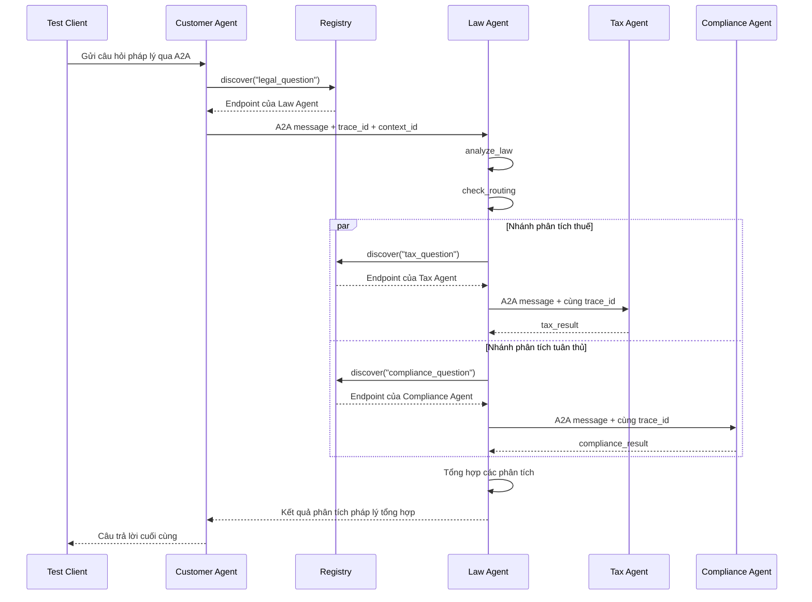

# Stage 5: Lab Distributed A2A

## Kiến Trúc

| Service | Port | Trách nhiệm |
|---|---:|---|
| Registry | 10000 | Đăng ký agent và tìm agent theo loại tác vụ |
| Customer Agent | 10100 | Điểm vào hệ thống và ủy quyền câu hỏi cho Law Agent |
| Law Agent | 10101 | Phân tích pháp lý, định tuyến và tổng hợp kết quả |
| Tax Agent | 10102 | Agent chuyên về pháp luật thuế |
| Compliance Agent | 10103 | Agent chuyên về tuân thủ quy định |

## Luồng Request



## 5.1 Theo Dõi Luồng Request

Lần chạy end-to-end đầu tiên đã thành công:

```text
test_client.py
  -> Customer Agent
  -> Law Agent
  -> Tax Agent và Compliance Agent chạy song song
  -> Law Agent tổng hợp kết quả
  -> Customer Agent
  -> test_client.py nhận response
```

`test_client.py` hiện tự sinh, in và gửi `trace_id` cùng `context_id` trong A2A
metadata. Trace của lần fault test:

```text
trace_id: f5ced465-6275-4761-9f41-4d289768dff4
context_id: 31ce5f99-592f-483f-bd19-1462f3efbacf
```

Trace của lần kiểm tra end-to-end sau khi restart Tax Agent:

```text
trace_id: b9592ced-88f0-4cdc-b278-6fe2f9ddcb6d
context_id: ef060a9d-8aba-4823-8b0b-0320be0b43a6
```

Customer Agent nhận metadata từ client. Hàm `delegate` tiếp tục gửi cùng
`trace_id` và `context_id` tới Law, Tax và Compliance Agent. Các
`AgentExecutor` đều ghi những giá trị này vào log. Registry hiện không nhận
trace metadata nên log discovery chưa thể liên kết bằng `trace_id`.

## 5.2 Dynamic Discovery Và Xử Lý Lỗi

Các bước kiểm tra:

1. Chỉ dừng Tax Agent bằng `Ctrl+C`.
2. Giữ Registry, Customer, Law và Compliance Agent tiếp tục chạy.
3. Chạy `python test_client.py`.
4. Quan sát log Law Agent và câu trả lời cuối cùng.

Kết quả mong đợi:

- Registry vẫn trả endpoint Tax Agent đã đăng ký trước đó.
- Kết nối A2A tới Tax Agent đã dừng sẽ thất bại.
- `call_tax` bắt exception và trả về kết quả `Tax analysis unavailable`.
- Law Agent và Compliance Agent vẫn tiếp tục xử lý.
- Node `aggregate` vẫn có thể tạo câu trả lời từ các kết quả còn lại.

Ghi nhận thực tế:

```text
Kết quả: request vẫn hoàn tất và client nhận được response.
Lỗi quan sát được: endpoint Tax Agent không còn lắng nghe sau khi dừng process.
Toàn bộ hệ thống có bị dừng không: không.
Response có chứa các phân tích còn lại không: có.
```

Final response vẫn có một phần nội dung về thuế dù Tax Agent đã dừng. Nguyên
nhân là Law Agent và model tổng hợp cũng có kiến thức thuế, nên nội dung cuối
không phải bằng chứng chắc chắn rằng Tax Agent đã được gọi thành công. Muốn
xác định trạng thái specialist phải kiểm tra endpoint và log theo `trace_id`.

Kết luận: Registry là service discovery lưu dữ liệu trong memory, chưa có
health check hoặc tự động xóa agent đã dừng. Law Agent có khả năng chịu lỗi một
phần vì nó cô lập lỗi của từng specialist agent.

## 5.3 Thay Đổi Hành Vi Tax Agent

Prompt của Tax Agent hiện yêu cầu:

- Câu trả lời cuối dưới 150 từ.
- Ưu tiên các hình phạt dân sự và hình sự quan trọng.
- Xác định cá nhân hoặc tổ chức phải chịu trách nhiệm.
- Nêu hành động cần thực hiện ngay.
- Không lặp lại câu hỏi của người dùng.

Các bước xác nhận:

1. Restart Tax Agent để nạp prompt mới.
2. Chạy lại `python test_client.py`.
3. So sánh phần Tax Agent trước và sau khi thay đổi.

```text
Trước: phần phân tích thuế chi tiết và dài.
Sau: Tax Agent trả trực tiếp 115 từ, dưới giới hạn 150 từ.
```

Final response từ `test_client.py` vẫn có thể dài vì Law Agent và Customer
Agent tiếp tục tổng hợp, định dạng và diễn giải lại kết quả của Tax Agent.

## Checklist Hoàn Thành Stage 5

- [x] Đã khởi động đủ năm service.
- [x] Registry hiển thị đủ bốn agent.
- [x] Request end-to-end đầu tiên chạy thành công.
- [x] Client đã tạo và gửi `trace_id` xuyên suốt A2A metadata.
- [x] Đã dừng Tax Agent và ghi nhận cách hệ thống xử lý lỗi.
- [x] Đã sửa prompt Tax Agent để trả lời ngắn hơn.
- [x] Đã restart Tax Agent và chạy lại end-to-end thành công.
- [x] Đã gọi trực tiếp Tax Agent và xác nhận response có 115 từ.
