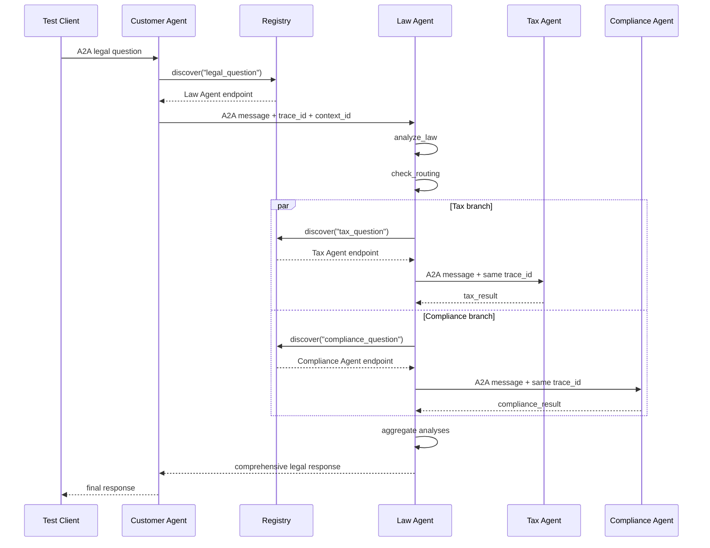

# Stage 5: Distributed A2A Lab

## Architecture

| Service | Port | Responsibility |
|---|---:|---|
| Registry | 10000 | Agent registration and task-based discovery |
| Customer Agent | 10100 | Entry point and delegation to Law Agent |
| Law Agent | 10101 | Legal analysis, routing, and aggregation |
| Tax Agent | 10102 | Tax-law specialist |
| Compliance Agent | 10103 | Regulatory-compliance specialist |

## Request Sequence



## 5.1 Trace Request Flow

The first end-to-end run completed successfully:

```text
test_client.py
  -> Customer Agent
  -> Law Agent
  -> Tax Agent and Compliance Agent in parallel
  -> Law Agent aggregate
  -> Customer Agent
  -> test_client.py response
```

Copy one `trace_id` from the Customer Agent log and verify that the same value
appears in the Law, Tax, and Compliance Agent logs:

```text
trace_id: <paste trace ID here>
Customer Agent: verified / pending
Law Agent: verified / pending
Tax Agent: verified / pending
Compliance Agent: verified / pending
```

The Registry does not currently receive the trace metadata. Its logs can still
show discovery calls, but they cannot be correlated by `trace_id`.

## 5.2 Dynamic Discovery and Failure Handling

Test procedure:

1. Stop only the Tax Agent with `Ctrl+C`.
2. Keep Registry, Customer, Law, and Compliance running.
3. Run `python test_client.py`.
4. Observe the Law Agent log and final response.

Expected behaviour:

- Registry still returns the registered Tax Agent endpoint.
- The A2A connection to the stopped Tax Agent fails.
- `call_tax` catches the exception and returns a `Tax analysis unavailable`
  result.
- Law and Compliance analysis continue.
- The aggregator can still produce a partial final response.

Observation:

```text
Result: pending
Error observed: pending
Did the full system crash? pending
Did the response contain the remaining analyses? pending
```

Conclusion: the Registry is an in-memory discovery service without health
checks or automatic deregistration. The Law Agent provides partial fault
tolerance by isolating specialist failures.

## 5.3 Modify Tax Agent Behaviour

The Tax Agent prompt now requires:

- A final response under 150 words.
- Priority on key civil and criminal penalties.
- Identification of responsible parties.
- Immediate recommended actions.
- No repetition of the user's question.

Validation procedure:

1. Restart the Tax Agent so it loads the new prompt.
2. Run `python test_client.py` again.
3. Compare the Tax Agent output with the first run.

```text
Before: detailed tax section
After: pending final verification; expected to be shorter and more focused
```

## Stage 5 Completion Checklist

- [x] All five services started.
- [x] Registry listed four agents.
- [x] First end-to-end request succeeded.
- [ ] One `trace_id` verified across Customer, Law, Tax, and Compliance logs.
- [ ] Tax Agent stopped and partial-failure behaviour recorded.
- [x] Tax Agent prompt changed to produce a concise response.
- [ ] Tax Agent restarted and final end-to-end request compared.
