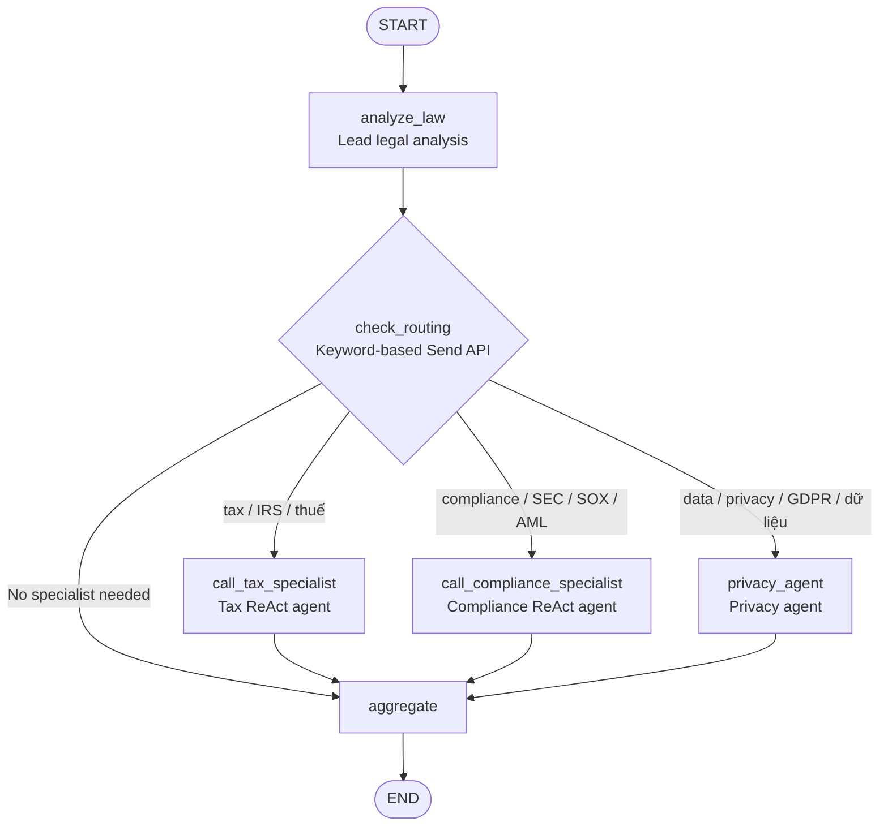

# Stage 4 Architecture

## Execution Flow

1. `analyze_law` creates the general legal analysis.
2. `check_routing` inspects the question and returns one or more LangGraph `Send` objects.
3. Tax, compliance, and privacy specialists run in parallel when their keywords match.
4. Each specialist writes to its own reducer-backed state field.
5. `aggregate` combines all available analyses into the final response.

Stage 4 runs every agent in one Python process. Stage 5 preserves the same orchestration idea but moves agents into independent HTTP services using the A2A protocol.
