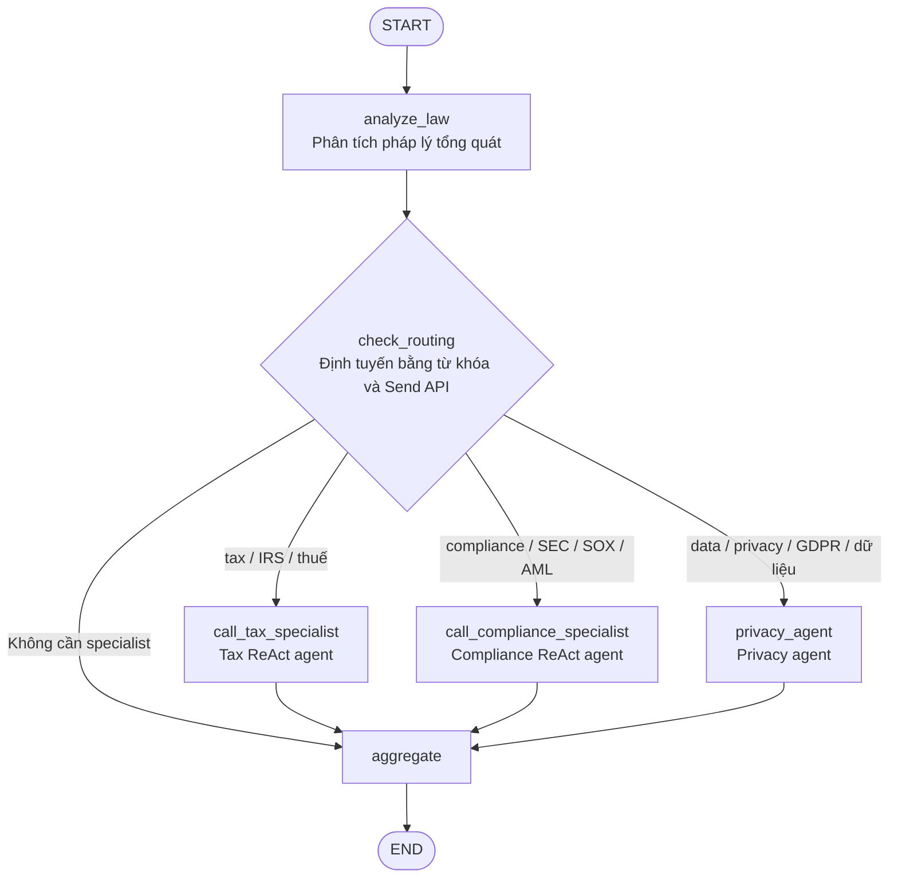

# Kiến Trúc Stage 4

## Luồng Thực Thi

1. `analyze_law` tạo phân tích pháp lý tổng quát.
2. `check_routing` kiểm tra câu hỏi và trả về một hoặc nhiều đối tượng LangGraph `Send`.
3. Tax, Compliance và Privacy Agent chạy song song khi câu hỏi chứa từ khóa tương ứng.
4. Mỗi specialist agent ghi kết quả vào một field riêng trong shared state có reducer.
5. `aggregate` kết hợp tất cả phân tích hiện có thành câu trả lời cuối cùng.

Stage 4 chạy tất cả agent trong cùng một Python process. Stage 5 giữ nguyên ý
tưởng điều phối này nhưng chuyển các agent thành những HTTP service độc lập và
giao tiếp bằng A2A protocol.
